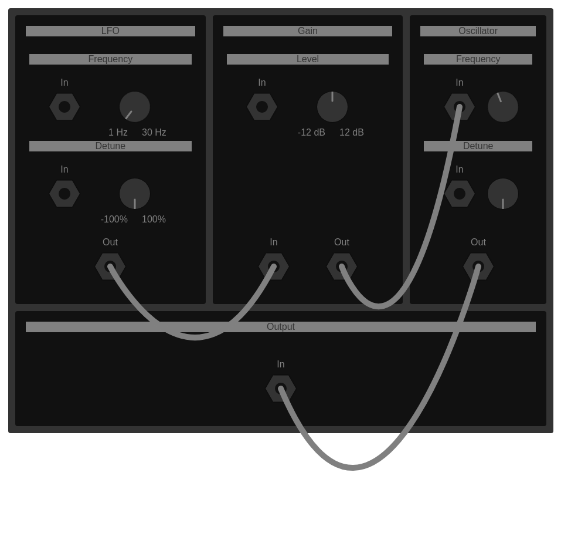
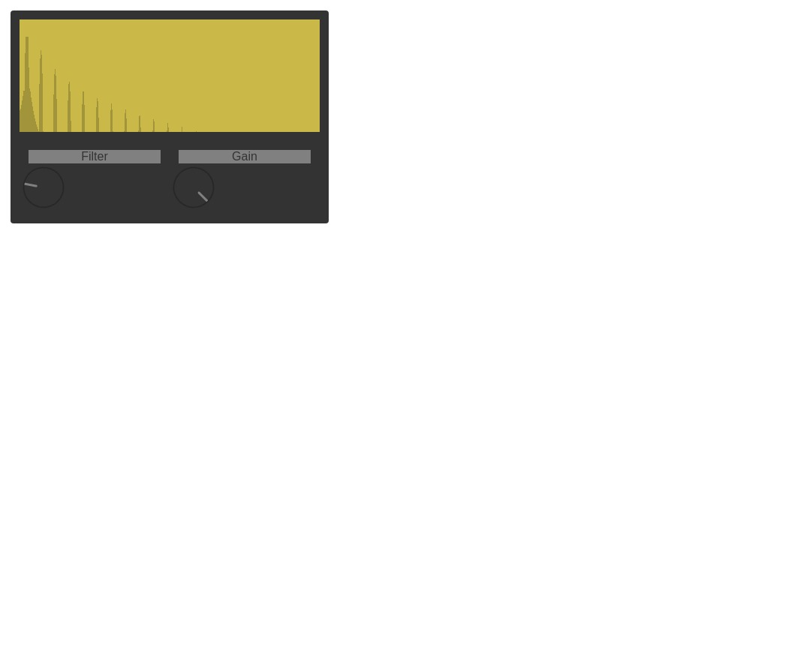
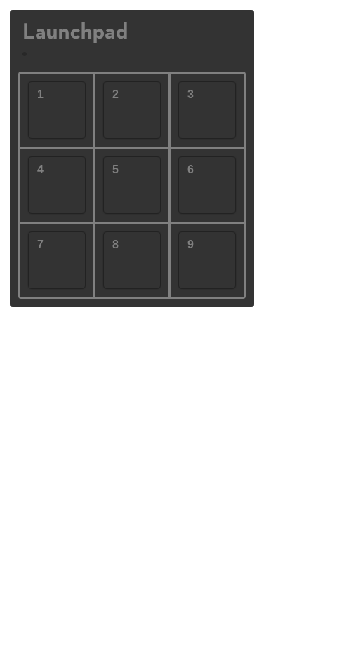

React components for JSynth.

Offers a basic wrapper around the Web Audio API and its built-in utilities.





# Startup
- `npm start`
- `sass --watch src`

# Context
At all points, the Web Audio API's context is available within the window object -- `window.ctx`.

Upon page instantiation, the context is halted as a default.
Upon any kind of mouse down event within the document, the context will be resumed and any audio will begin playing.

# Component
## Control
Takes hooks as props and calls them on various events, passing the internal value as an argument.

### `<Btn />`
Calls a function on push.

### `<Knob />`
Calls a function on turning, providing a value.

#### Props
---
`min` - Range minimum
`max` - Range maximum
`rad` - Radius
`quant` - Quantize
`marked` - Mark range

#### Quantized
For numeric values specifically meant to be integral, the `quant` prop can be passed.

This will snap the knob and its values to specific increments.

### `<Fader />`
Calls a function on dragging, providing a value.

Limited to a range.

#### Props
---
`ln` - Height
`marked` - Mark range

### `<Key />`
Calls a function on press.

#### Props
---
`node` - Source

### `<Port />`
"CV port", contains a reference to an audio node or parameter.

Connected via cable when appropriate event fires.

#### `<In />`
Audio node's input or audio parameter.

Connects cable when present on mouse up.
Detaches cable when present on mouse down.

Can have at most one input.

#### Props
---
`hookDown` - Function to call upon mouse down
`hookUp` - Function to call upon mouse up

#### `<Out />`
Strictly regards audio node's output.

Creates cable with the in-point being the port's output.
Detaches cable when present on mouse down.

Can have an effectively infinite number of outputs.

#### Props
---
`hookDown` - Function to call upon mouse up

## Display
### `<Light />`
Binary light.

On upon the presence of the `on` prop, and off otherwise.

#### Props
---
`data` - Value

### `<LCD />`
Base LCD.

#### Methods
`.clear()` - Clear display

#### `<Spectrum />`
Plots frequency.

`.draw()` - Draw

#### Props
---
`wd` - Width (pixels)
`ht` - Height (pixels)

### `<Meter />`
Displays signal strength.

`.draw()` - Draw

#### Props
---
`tick` - Height

### `<Text />`
2D Text display.

#### Props
---
`wd` - Width (characters)
`ln` - Height (lines)
`l` - Line index

## `<Bay></Bay>`
Patch bay.

Contains modules and offers an interface to connect their CV ports via cables. 

### `<Module></Module>`
Contains internal nodes.

Ports are provided for the node itself, depending on the type of its node.

Sources - One out
Effects - One in, one out
Destinations - One in

For the node's specified parameters, one in port is provided.

The following examplifies creation of a module.

```
class Osc extends Source {
	constructor(props) {
		super(props);

		this.node.main = window.ctx.createOscillator();
	}
}
```

As a default, parameters are mapped to produce individual sections with a knob and an input port.

Child elements can be used to extend.

### Props
`name` - Title
`param` - List of parameters
`hookInDown` - Function to call on in port's mouse down event
`hookInUp` - Function to call on in port's mouse up event
`hookOutDown` - Function to call on in port's mouse up event

# Source
## `<Osc />`
Oscillator.

### Props
`type` - "sine" / "square" / "sawtooth" / "triangle" / "custom"

## `<Op />`
Basic operator with a programmable type.

Contains an oscillator and a gain.

### Props
`type` - "sine" / "square" / "sawtooth" / "triangle" / "custom"

# Effect
## `<Gain />`
Increases or decreases signal.

### Props
`level` - Level

## `<Filter />`
Attenuates frequencies.

### Props
`type` - "lowpass" / "highpass" / "bandpass"

### `<Lowpass />`
`rng` - Ranges of parameters

### `<Highpass />`
`rng` - Ranges of parameters

## `<Chorus />`
Splits input into multiple outputs.

### Props
`spread` - Phase shift

## `<Flanger />`
Produces delayed copy.

### Props
`type` - "sine" / "square" / "sawtooth" / "triangle" / "custom"

## `<Pan />`
Fades between left and right channels.

### Props
`rate` - Rate

## `<Delay />`
Outputs unfiltrered input after a time interval has passed.

### Props
`time` - Time in seconds

## `<Env />`
ADSR envelope.

### Props
`atk` - Attack
`decay` - Decay
`sust` - Sustain
`rel` - Release

# Destination
## `speaker()`
Audio output.

# Worklet
Base worklet.

Takes a file name containing declarations.

# Examples
Examples simply extending lower-level components are provided.

## Components
### `<Piano />`
Array of white and black keys laid out according to the harmonic scale.

Internal is a basic sine wave.

### `<Launch />`
Grid of buttons all hooked to various samples.

### `<Synth />`
Synthesizer containing oscillators assigned to the basic waveforms, an LFO and both high and low-pass filters.

### `<Impulse />`
Takes a button and hooks it to a sample.

## Worklets
### Bitcrush
Reduces fidelity.

# Resources
Resources are situated in the "public" directory.

Dedicated directories for specific file types exist depending on the usage.

"/snd" - Samples
"/worklet" - Worklet files, may contain multiple definitions

# Math
Various musical constants and utilities.

`a` - Middle A
`oct` - Number of full steps in octave
`semi` - Number of full, half steps in octave

`note` - Integral note, based off middle A
`trans` - Transpose pitch up or down from original

## Classes
### `Chord`
Base chord.

#### `Triad`
`Maj` - Major
`Min` - Minor

# Utilities
Miscellaneous utilities.

`clamp(no, min, max)` - Clamp a value between a range

`fmt(i, off)` - Conversion of tone to formatted note on the harmonic scale

# Formatting
Formats for various integer values are provided in "fmt.js".

For control elements, when the `marked` prop exists, the appropriate will suffix the numeric values.
